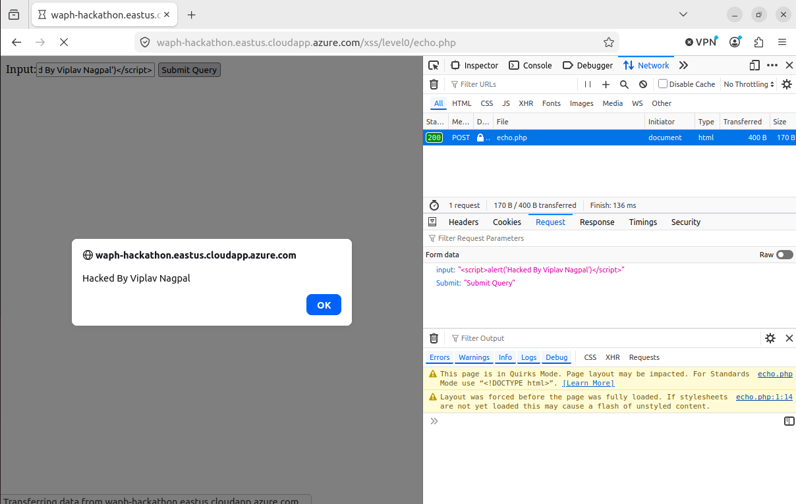
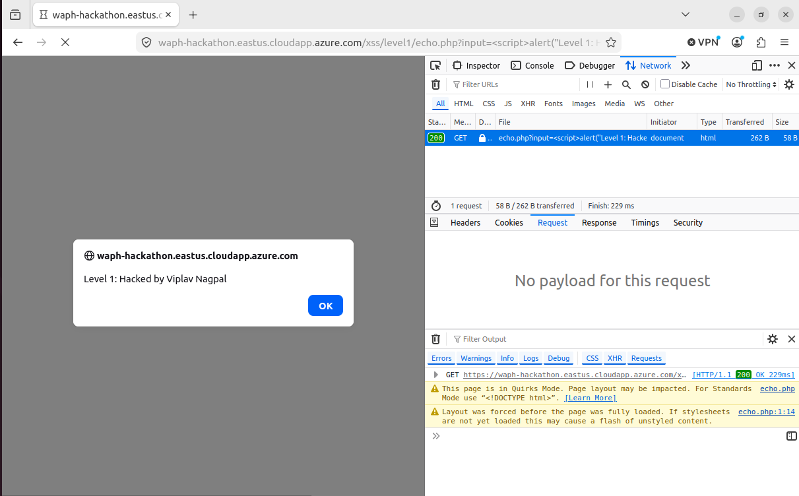
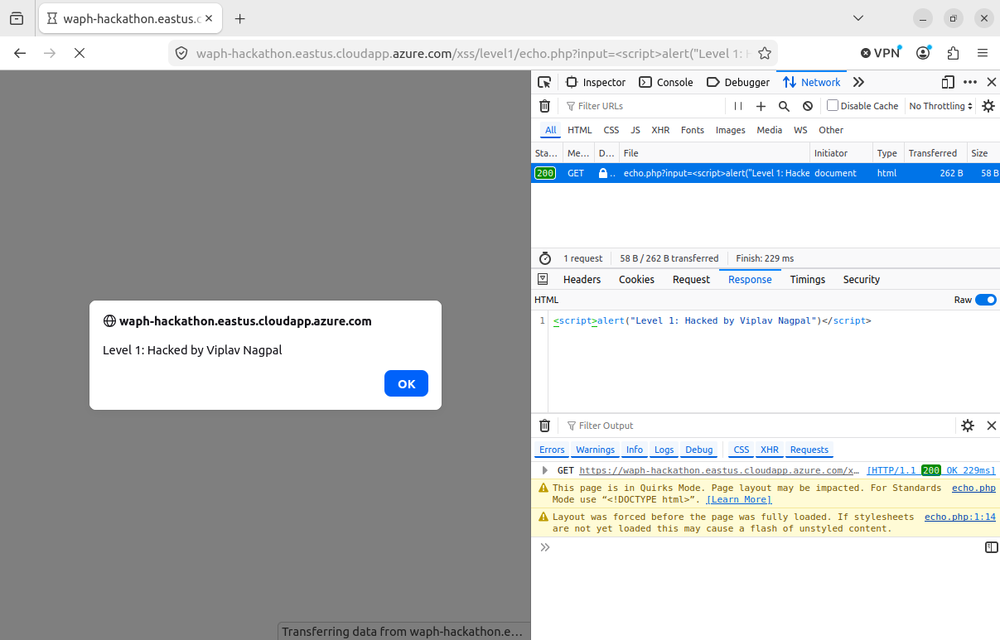
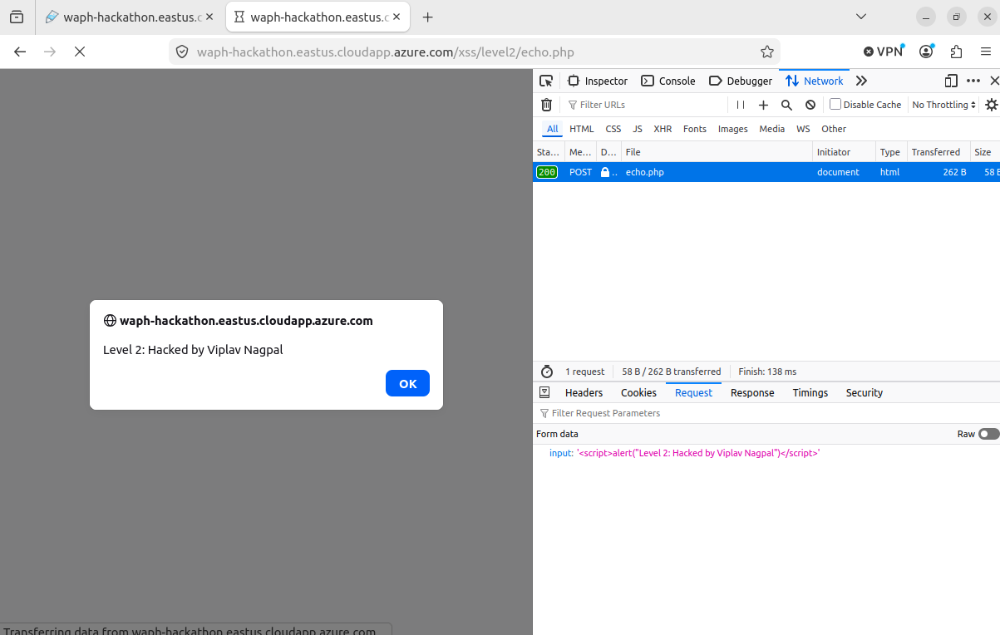
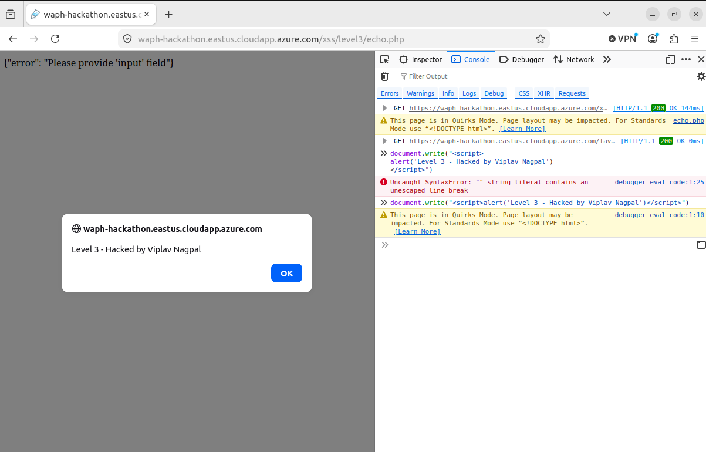
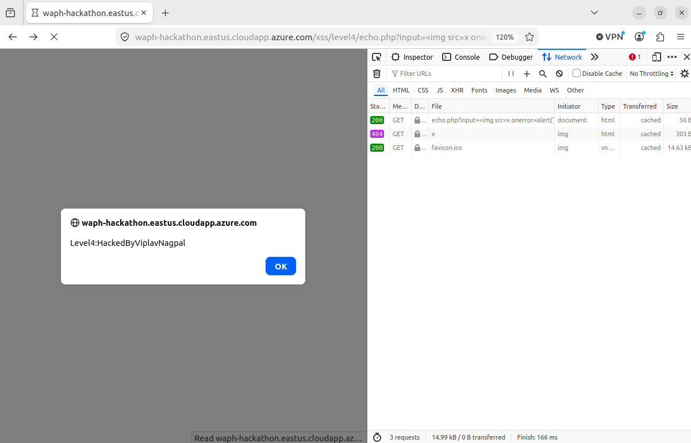
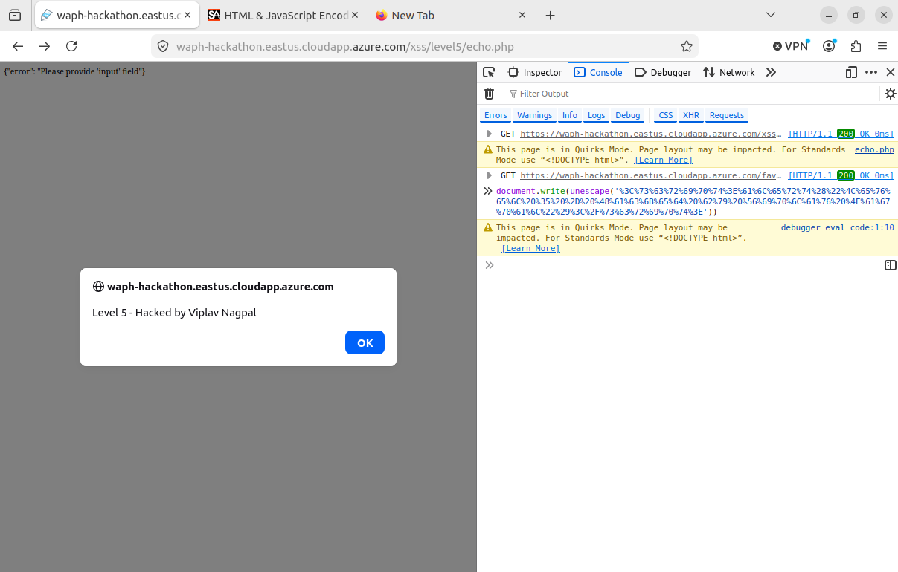
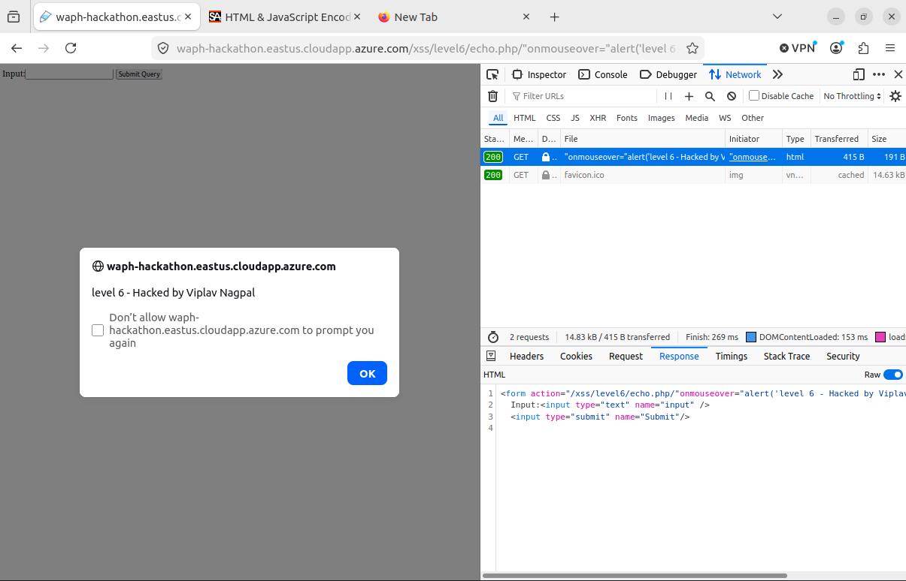

# waph-nagpalvv
# WAPH-Web Application Programming and Hacking
# Hackathon 1 Report

## Instructor: Dr. Phu Phung

## Student

**Name**: Viplav Nagpal

**Email**: nagpalvv@mail.uc.edu (viplavnagpal1704@gmail.com)

**Short-bio**: I love programming and building stuff. I took this course to learn how to build stuff and add security for the stuff I build, including websites, machine learning models and so much more.


# Hackathon 1 - Cross-site Scripting Attacks and Defenses

## The hackathon's overview:

In this hackathon, I performed reflected cross-site scripting (XSS) attacks across seven progressively hardened levels on the course hackathon server, then applied defensive coding to my own Lab 1 and Lab 2 applications. Through the attacks, I learned that XSS arises whenever untrusted input is reflected into an HTML page without proper encoding, and that weak defenses—HTTP method restrictions, tag stripping, and substring blacklists—are routinely bypassed. Through the defenses, I learned that input must be validated before use and encoded before display across every external data channel. I did not know much of php for this report to be able to guess the code properly so I had to google the documentation and learn a bit through that and then guess the code. It might be wrong i don't know exactly.

**Link to this hackathon report**: [https://github.com/nagpalvv/waph-nagpalvv/tree/main/labs/Hackathon-1]
---

## Task 1: Attacks

For each level, I injected code to display my name using `alert()` (or an equivalent where `alert` was blocked). Each attack is shown with a screenshot of the full URL and the payload inspected in the browser.

### Level 0 — No defense (GET)

The server takes the GET parameter `input` and echoes it directly into the HTML page with zero filtering.



---

### Level 1 — GET, no filter

Same as Level 0 with no sanitization—the server echoes the `input` parameter from a GET request without encoding.





---

### Level 2 — POST only, no filter

Same as Level 0 with no sanitization, but the server only accepts POST requests. Restricting the HTTP method is not a security measure.



**Guessed source code:**

```php
<?php
// Level 2 — POST only, no input sanitization

if (!isset($_POST['input'])) {
    echo '{"error": "Please provide \'input\' field in an HTTP POST Request"}';
} else {
    echo $_POST['input'];
}
```

---

### Level 3 — Strips `<script>` and `</script>` tags

The server removes `<script>` and `</script>` from the POST body, but other HTML contexts such as event handlers or `document.write()` are still reflected.



**Guessed source code:**

```php
<?php
// Level 3 — strips <script> and </script>, then echoes without encoding

if (!isset($_REQUEST['input'])) {
    echo '{"error": "Please provide \'input\' field"}';
} else {
    $input = $_REQUEST['input'];
    $input = str_replace('<script>', '', $input);
    $input = str_replace('</script>', '', $input);
    echo $input;
}
```

---

### Level 4 — Blocks the word "script" anywhere

The filter rejects input if the string `script` appears anywhere—not only as a tag.



**Guessed source code:**

```php
<?php
// Level 4 — rejects input containing "script"

if (!isset($_REQUEST['input'])) {
    echo '{"error": "Please provide \'input\' field"}';
} else if (strpos($_REQUEST['input'], 'script') != false) {
    echo '{"error": "No \'script\' is allowed!"}';
} else {
    echo $_REQUEST['input'];
}
```

---

### Level 5 — Blocks "script" and "alert"

Extends Level 4 by also blocking the word `alert`. Other JavaScript functions such as `document.write()` are not filtered.



**Guessed source code:**

```php
<?php
// Level 5 — rejects input containing "script" or "alert"

if (!isset($_REQUEST['input'])) {
    echo '{"error": "Please provide \'input\' field"}';
} else if (strpos($_REQUEST['input'], 'script') != false) {
    echo '{"error": "No \'script\' is allowed!"}';
} else if (strpos($_REQUEST['input'], 'alert') != false) {
    echo '{"error": "No \'alert\' is allowed!"}';
} else {
    echo $_REQUEST['input'];
}
```

---

### Level 6 — `htmlentities()` on input, but URL path unescaped

The form input is encoded with `htmlentities()`, but `$_SERVER['REQUEST_URI']` is reflected unescaped in the form `action` attribute.



**Guessed source code:**

I don't know.

---

## Task 2: Defenses

I reviewed my vulnerable Lab 1 and Lab 2 code, identified all external input data channels, validated the data before using it, and encoded the data before displaying it in the webpage.

### echo.php (Lab 1)

The original `echo.php` from Lab 1 echoed user input directly with no protection:

```php
<?php
echo $_REQUEST["data"];
?>
```

This allowed reflected XSS because any value submitted through GET or POST—including a `<script>` tag—was sent back to the browser and executed as HTML.

I revised `echo.php` to validate input before use and encode it before output. The updated version checks that the `data` parameter exists, rejects empty or overly long input, blocks dangerous patterns such as angle brackets and event handlers, and uses `htmlspecialchars()` before echoing. The response is also served as `text/plain` so the browser does not interpret it as HTML.

```php
<?php
header('Content-Type: text/plain; charset=utf-8');

if (!isset($_REQUEST['data'])) {
    http_response_code(400);
    die('Error: missing data parameter');
}

$input = trim($_REQUEST['data']);

if ($input === '') {
    http_response_code(400);
    die('Error: empty input');
}

if (strlen($input) > 200) {
    http_response_code(400);
    die('Error: input too long');
}

if (preg_match('/<|>|script|javascript:|on\w+\s*=/i', $input)) {
    http_response_code(400);
    die('Error: invalid input');
}

echo htmlspecialchars($input, ENT_QUOTES | ENT_SUBSTITUTE, 'UTF-8');
?>
```

---

### Front-end prototype (Lab 2)

I reviewed `waph-nagpalvv.html` and `email.js` and identified several external input channels where untrusted data could reach the DOM.

The HTTP GET and POST forms both send a user-controlled `data` field to `echo.php`. This was vulnerable to reflected XSS on the server side and is addressed by the revised `echo.php` above.

The vanilla Ajax function `getEcho()` reads from the `#data` input and sends it to `echo.php` via a GET request. The response was displayed using `innerText`, which is safer than `innerHTML`, but the input was not validated client-side and was not URL-encoded before being placed in the request string.

The jQuery Ajax functions `JQueryAjax()` and `JQueryAjaxPost()` also read from `#data` and send the value to `echo.php`. Both functions used `$("#response").html()` to display the server response, which treats the returned text as HTML and creates a DOM-based XSS risk if the server ever echoes unsanitized content.

The `guessAge()` function takes a name from the user and queries the Agify API. The name and the returned `age` value were inserted into the page through `$("#response").html()` without validation or encoding.

On page load, a Joke API request fetches `result.joke` from an external server and displays it with `$("#response").html()`. Because the joke string comes from a third-party API, it must be treated as untrusted input before being placed in the DOM.

In `email.js`, the show/hide email toggle originally used `innerHTML` to insert a mailto link. Even though the email string is static, using `innerHTML` is an unsafe pattern for DOM updates.

To defend these channels, I added client-side validation for echo and name inputs, used `encodeURIComponent()` when building Ajax URLs, replaced `.html()` with `.text()` wherever untrusted data is displayed, validated API responses before use, and updated `email.js` to build the mailto link with `createElement` and `textContent` instead of `innerHTML`.
