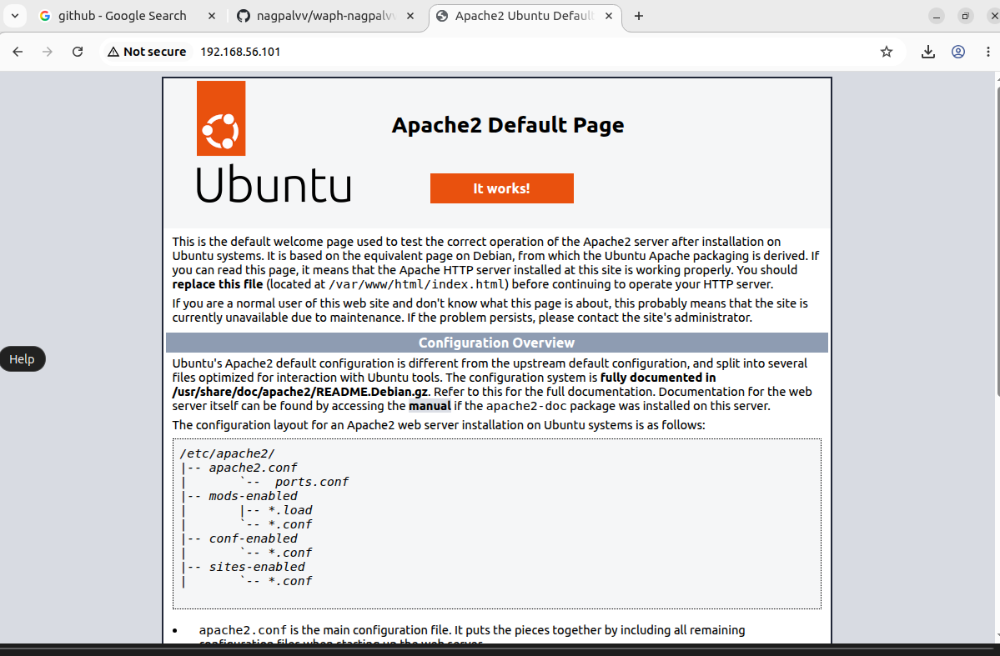
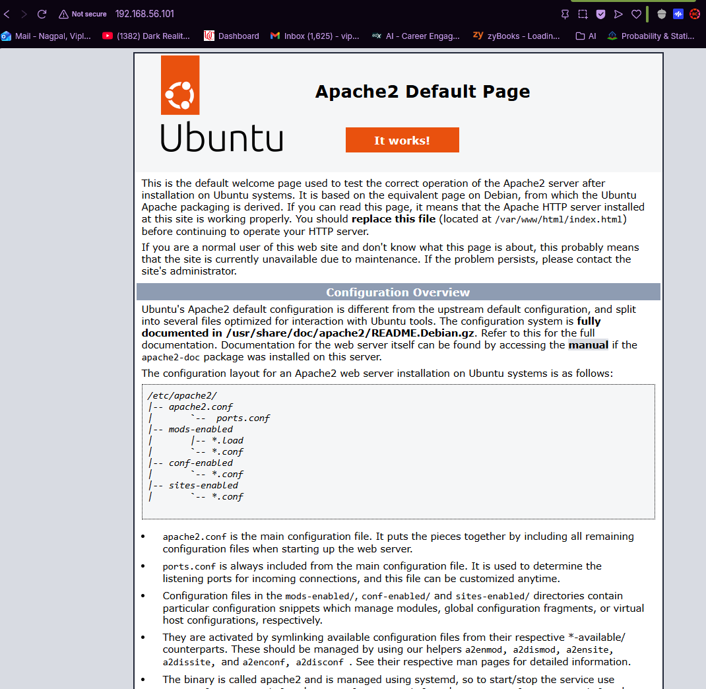
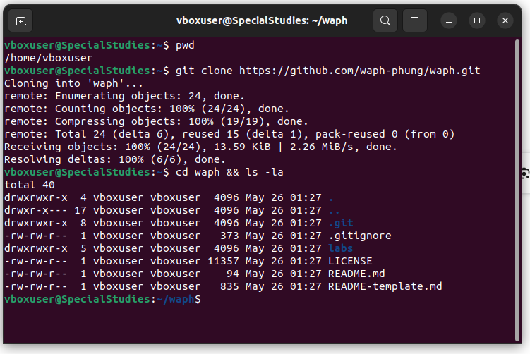
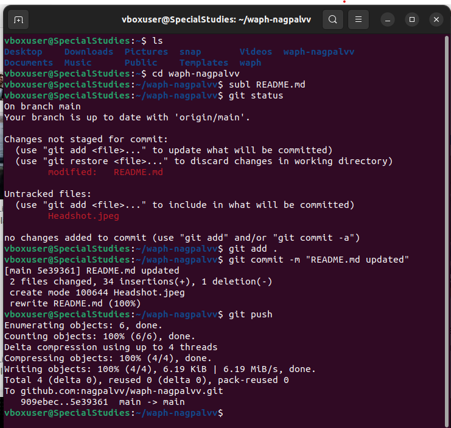

# waph-nagpalvv
# WAPH-Web Application Programming and Hacking
# Lab 0 Report

## Instructor: Dr. Phu Phung

## Student

**Name**: Viplav Nagpal

**Email**: nagpalvv@mail.uc.edu (viplavnagpal1704@gmail.com)

**Short-bio**: I love programming and building stuff. I took this course to learn how to build stuff and add security for the stuff I build, including websites, machine learning models and so much more.

# Lab 0 - Development Environment Setup

## Overview:
This lab is covered in Lecture 2, with preparation homework in Lecture 1. In Part I, we set up an Ubuntu 22.04 Virtual Machine on VirtualBox and install software and applications. In Part II, we cloned the course repository and our private repository and complete the `git` exercises to write this report.

## The lab's overview:
Lab 0 taught us how to install Ubuntui 24.04 and set it up on the virtual machine. We also learned about libraries like pandoc which converts a markdown file to a pdf. We also created a our private repo which we cloned by generating an SSH key first. We also learnt how to clone a public repository by cloning the course repository. We learnt how to write in markdown while preparing this lab report.
**Link to this lab report**: [https://github.com/nagpalvv/waph-nagpalvv/tree/main/labs/lab0]

## Part 1:

### Step 1:
Installed Ubuntu 22.04 on our laptops

### Step 2:
Installed VirtualBox by Oracle on our laptops and set up a virtual machine by using the Ubuntu OS
### Step3:
After installation, we downloading some pre-requisite libraries like apache and pandoc and also set up chrome to be able to acces the web easier and done!

### Apache Web Server Testing:
**Apache Test on VM**:

**Apache Test on Laptop**:

## Part II - git Repositories and Exercises

### The course repository

## Private Repository

### Critical steps to creating a private repository:
To create a private repository I navigated to GitHub and created a new repository named waph-nagpalvv ensuring that the visibility was set to **Private**. After creating the repository, I navigated to the repository's **Settings** tab, selected Collaborators, and added the user phung-waph" to grant them access to the repo.

**Repository URL**: [https://github.com/nagpalvv/waph-nagpalvv.git]

### Summary of Hands-on Exercises:
**Generating SSH keys**: Opened the terminal on the VM and used "ssh-keygen" command to generate a new SSH ey pair.

**Adding Public key to GitHub**: I viewed my public ey using command cat ~/.ssh/id.rsa.pub and copied the output and added it to my Github accound under Settings > SSH > New SSH key to establish a secure connectiong between my VM and GitHub.

**Cloning Repository**: Using the terminal, I ran the git clone command along with my repositorys URL to download a local copy of the remote repository into my VM.

**Editing the README.md file**: I opened the README.md file in a text editor and updated the provided template with my personal information.

### Commiting Changed:

