# waph-nagpalvv
# WAPH-Web Application Programming and Hacking
# Lab 2 Report

## Instructor: Dr. Phu Phung

## Student

**Name**: Viplav Nagpal

**Email**: nagpalvv@mail.uc.edu (viplavnagpal1704@gmail.com)

**Short-bio**: I love programming and building stuff. I took this course to learn how to build stuff and add security for the stuff I build, including websites, machine learning models and so much more.

# Lab 2 - Front-end Web Development

## The lab's overview:
Through this lab, I gained a comprehensive understanding of how the three core pillars of the web—HTML, CSS, and JavaScript—interact to create dynamic, user-friendly applications. I learned how to structure semantic webpages using HTML and style them cleanly using external and internal CSS layouts. 

Crucially, I developed a strong grasp of asynchronous programming and the Document Object Model (DOM). By implementing vanilla Ajax and the jQuery library, I learned how to seamlessly send and receive data from a server in the background, updating specific parts of a webpage without interrupting the user experience with a hard reload. Furthermore, integrating the Joke API and Agify API taught me how to parse complex JSON payloads and handle cross-origin resource sharing (CORS) security policies using modern `fetch()` protocols. Overall, this lab successfully bridged the gap between static web design and interactive, API-driven front-end development.

**Link to this lab report**: [https://github.com/nagpalvv/waph-nagpalvv/tree/main/labs/lab2]

---

## Task 1: Basic HTML with forms, and JavaScript

### a. HTML
We developed a foundational HTML file named `waph-nagpalvv.html`. This page includes structural header tags, an image of my headshot, and basic HTML forms configured to send data via HTTP GET and POST requests.

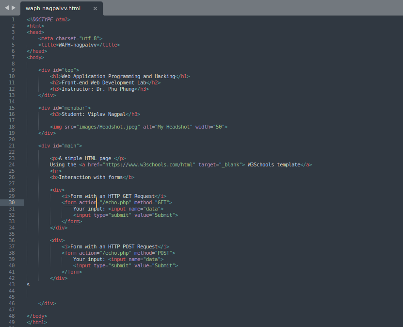

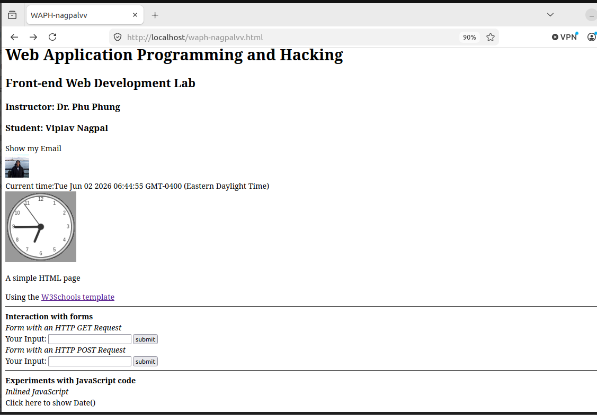

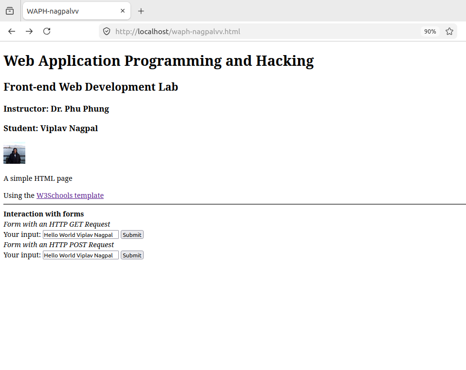

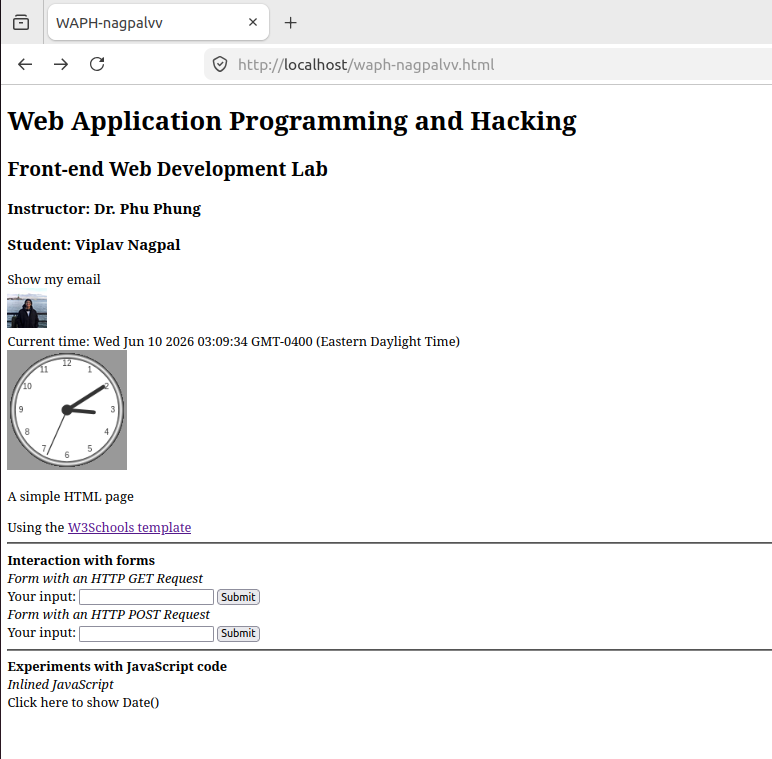

### b. Simple JavaScript
We implemented various JavaScript techniques to make the webpage interactive:

* **Inline JavaScript:** We added an `onclick` event to a `
` to display the current date and time, and an `onkeypress` event to the form input fields to log keystrokes to the console.

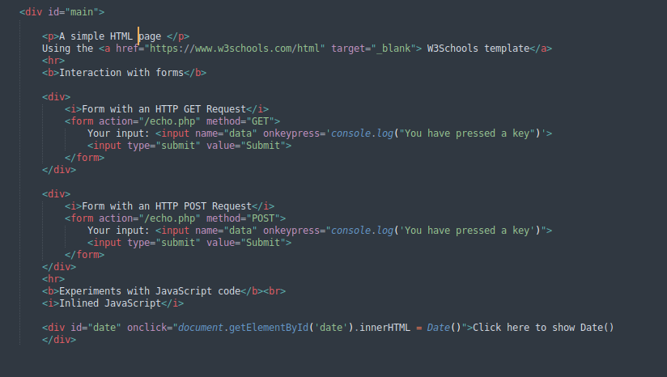

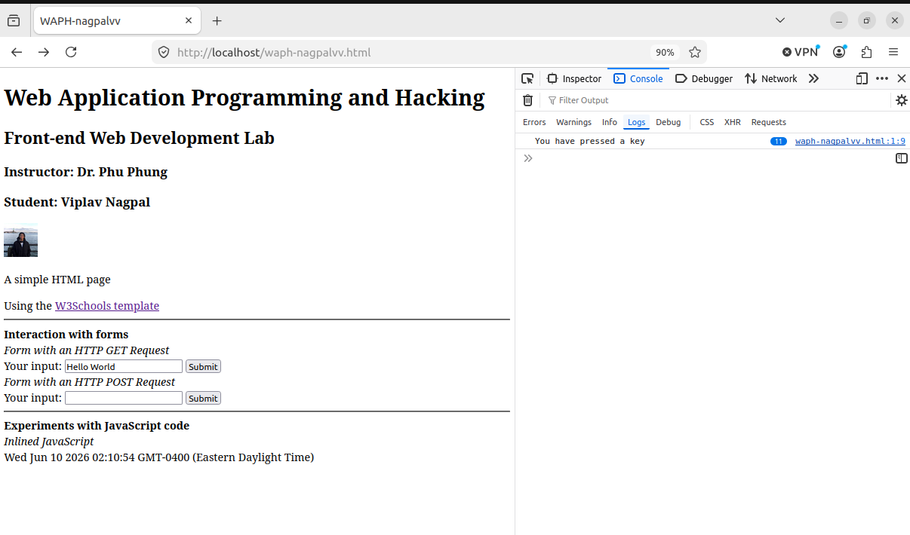

* **Email JS:** We separated the logic to toggle the visibility of an email address into an external file (`email.js`) to protect it from basic scraping.

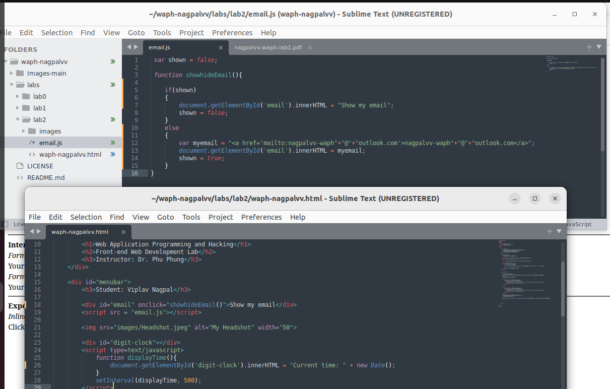

* **Digital and Analog Clocks:** We used a `<script>` tag within the HTML to create a `setInterval` function that dynamically updates a digital clock every 500 milliseconds. Furthermore, we utilized an external JavaScript file to draw a functioning analog clock on a `<canvas>`.

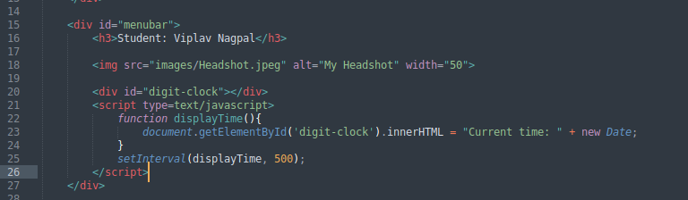

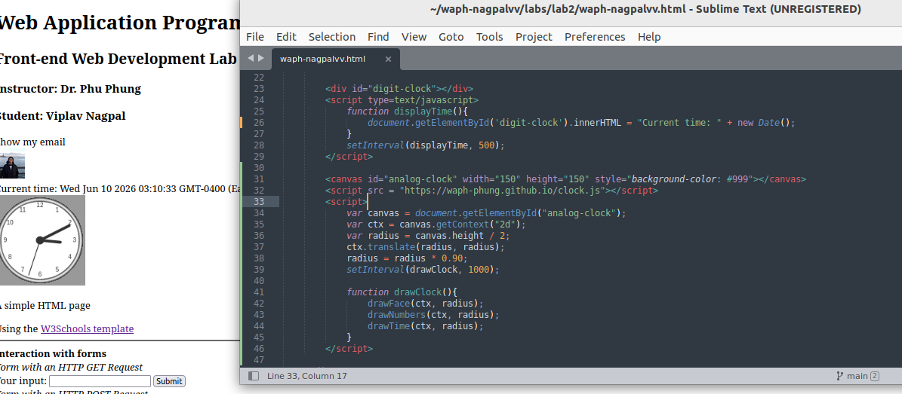

---

## Task 2: Ajax, CSS, jQuery, and Web API integration

### a. Ajax
We added a new input field and a button to handle asynchronous requests. Using vanilla JavaScript and the `XMLHttpRequest` object, we constructed an `xhttp.open("GET", ...)` request that grabs the user's input and sends it to our local `echo.php` application without reloading the webpage.

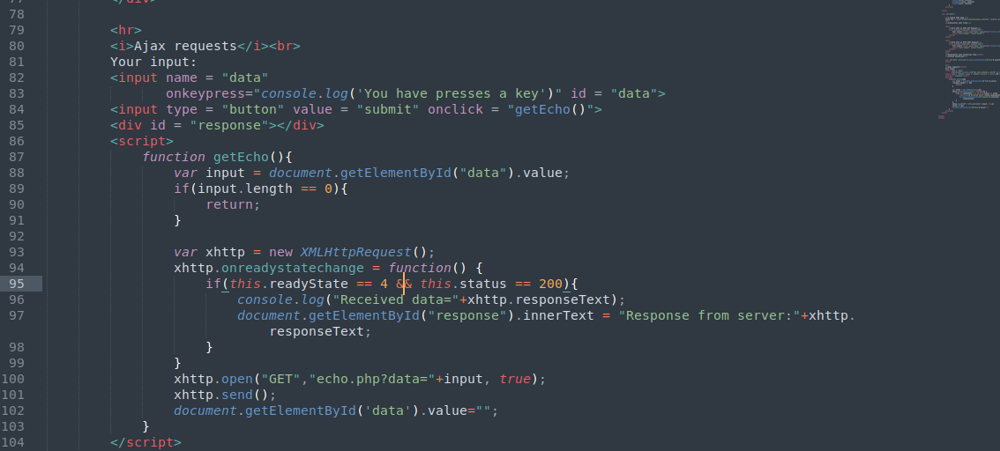

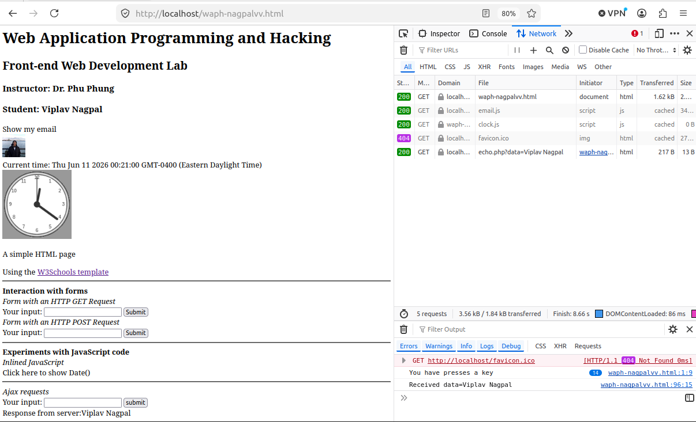

### b. CSS
We enhanced the visual layout of the page by incorporating CSS. We linked a remote external stylesheet (`style1.css`) for the overall container and layout wrapper structure, and added internal styling classes for the buttons and response containers.

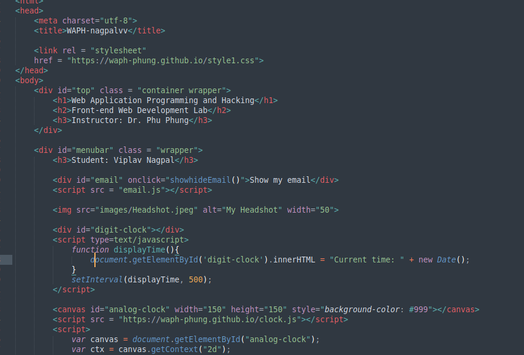

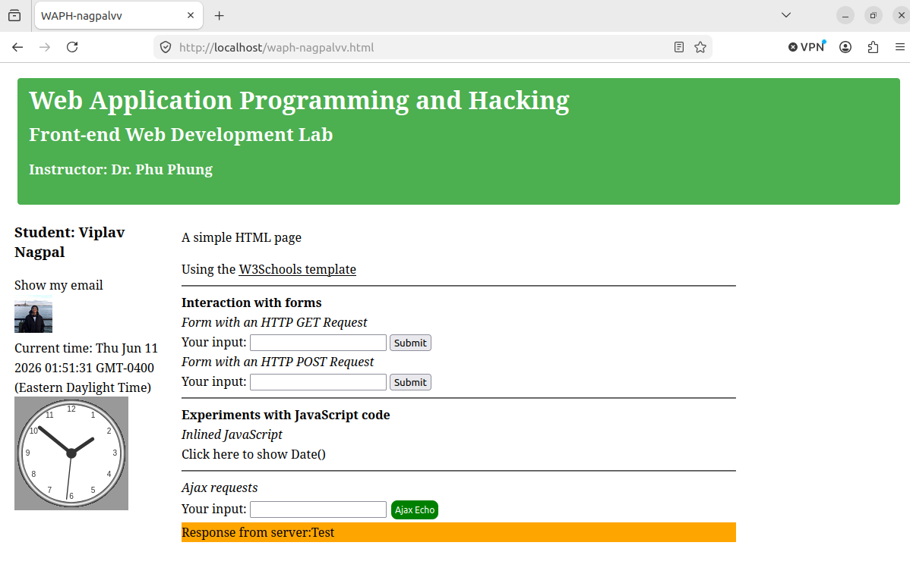

### c. jQuery
To streamline our Ajax calls, we imported the jQuery 3.7.1 library. We then replicated the vanilla Ajax functionality using jQuery's simplified syntax for both GET and POST requests securely in the background.

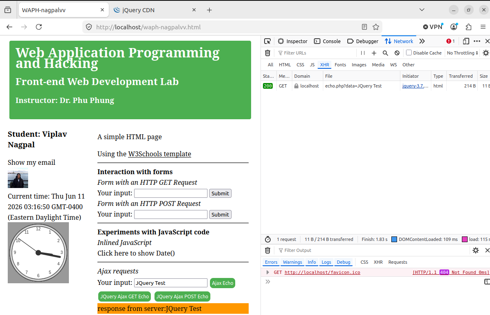

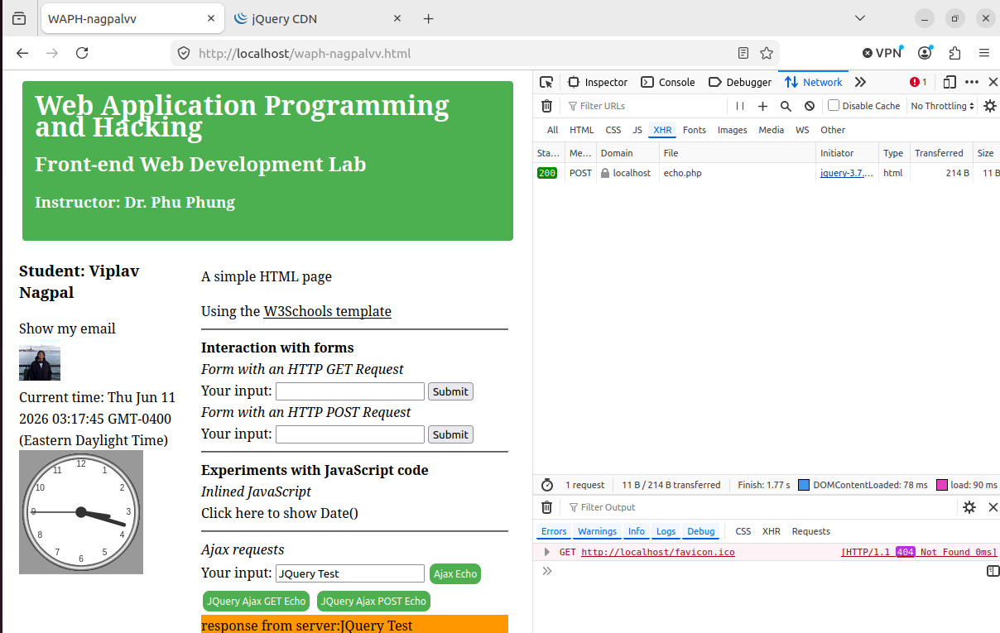

### d. Web API integration

#### i. Joke API (jQuery)
We configured an automatic API call using jQuery's `$.get()` that triggers as soon as the JavaScript block runs. It fetches a random programming joke from `v2.jokeapi.dev` and dynamically displays it inside the response `
`.

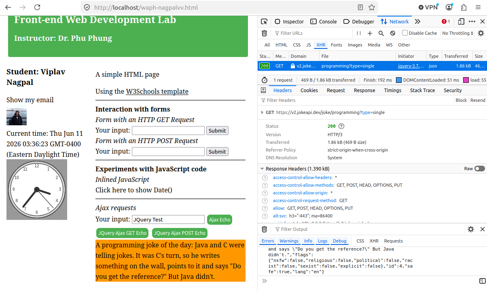

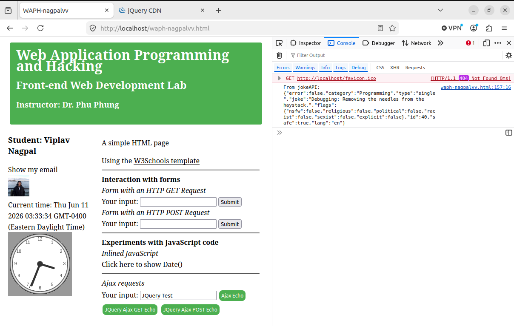

#### ii. Agify API (Fetch)
We utilized modern asynchronous JavaScript (`async/await`) alongside the `fetch()` API to predict a user's age based on their name. We updated the endpoint to `https://` to bypass CORS and mixed-content restrictions, successfully grabbing the input, querying `api.agify.io`, parsing the returned JSON, and updating the DOM.

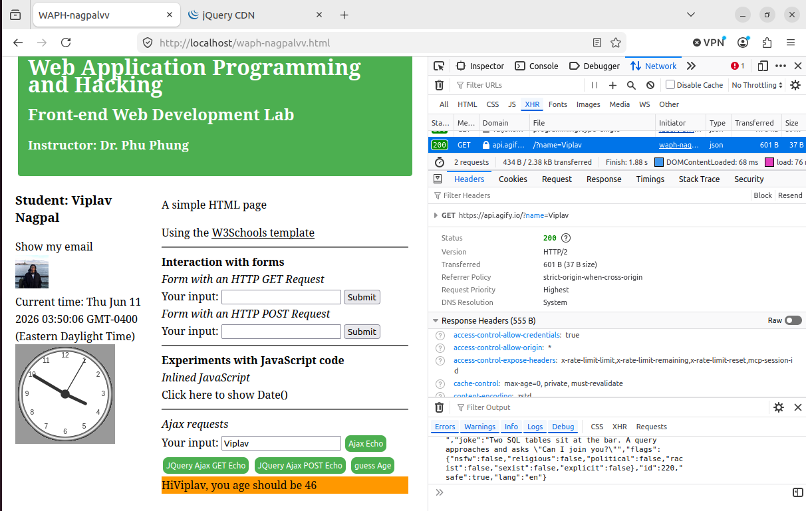